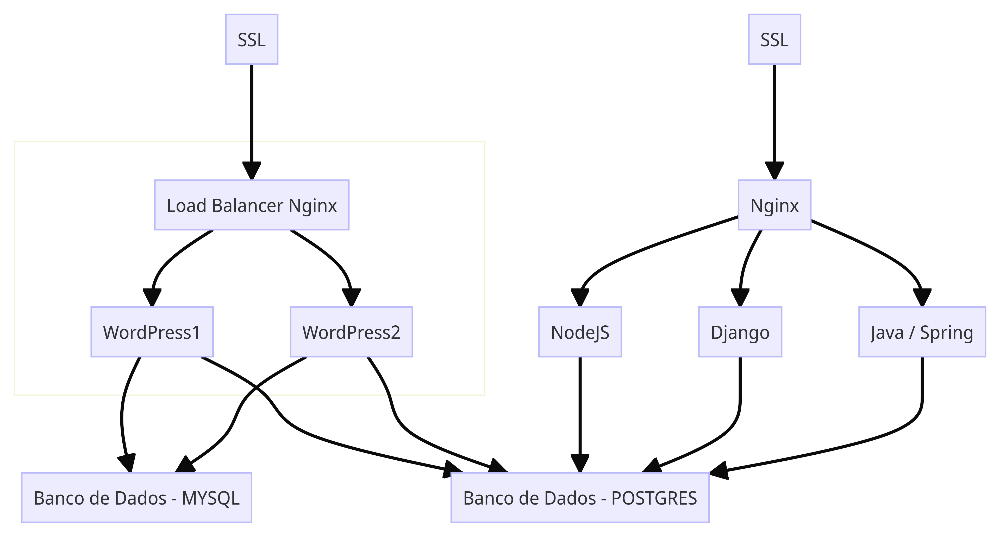

# AwsCase: Estudo de Caso para a Aula de DevOps

Bem-vindo ao repositório `AwsCase`. Este projeto faz parte de um estudo de caso para uma aula de DevOps do programa +Devs2Blu 2023 do prof. Adriano Machado e consiste na construção de 4 aplicações usando Django (Python), NodeJs (JavaScript), Spring Boot (Java). As aplicações são servidas por um servidor Nginx e precisam conectar ao mesmo banco de dados. Além disso, temos uma instância do Wordpress que está sendo gerenciada por outro Nginx com um balanceador de carga usando 2 instâncias do Lightsail e seu próprio balanceador de carga.




## Pré-requisitos

Antes de começar a executar o projeto, é necessário:

1. Configurar uma conta na AWS e ter uma conexão com um banco de dados MYSQL e um banco de dados Postgres.

2. Configurar sua instância para ter docker e docker-compose instalados.
   
3. Como este projeto possui submódulos, lembre-se de cloná-lo com o comando:
   ```
   git clone https://github.com/Guarda-Sol/AwsCase.git --recursive
   ```
4. Configurar algumas variáveis de ambiente. Crie um arquivo `.env` e escreva:
   ```
    DB_URL=
    DB_USER=
    DB_PASSWORD=
    DB_NAME=
   ```
   Exemplo de como escrever no arquivo: `DB_URL=YOUR_URL`. Não é necessário encapsular suas variáveis com aspas.

5. Agora, navegue pelos repositórios dos submódulos e leia suas instruções. Quando terminar de configurar tudo é só executar o comando em uma instância EC2:

```
  sudo docker-compose up --build
```

## Contribuição

Sinta-se à vontade para contribuir e melhorar este projeto. Todas as sugestões e contribuições são bem-vindas!

## Licença

Este projeto está licenciado sob a licença MIT - veja o arquivo [LICENSE.md](LICENSE.md) para mais detalhes.
